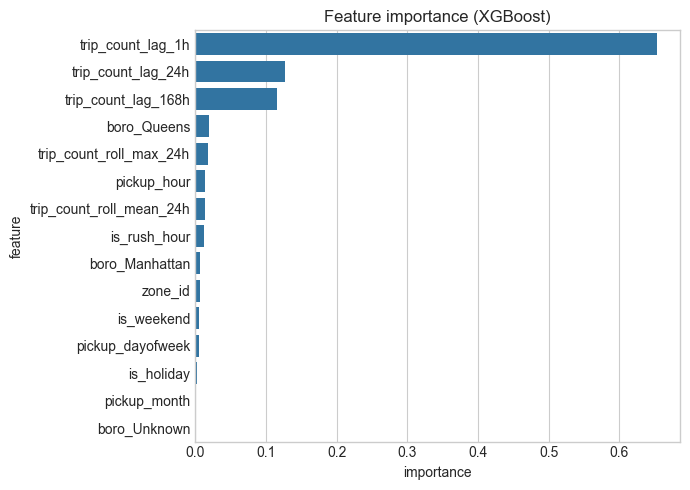
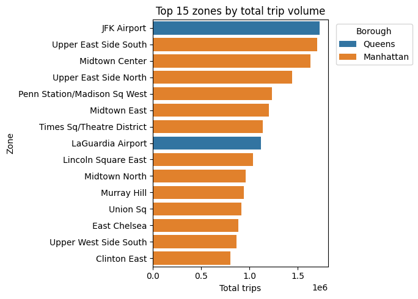
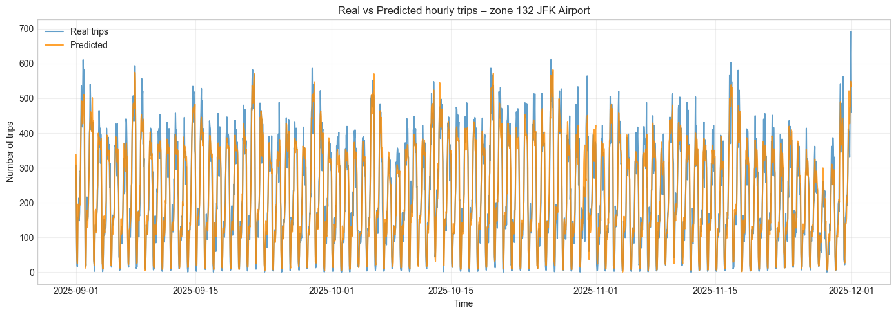
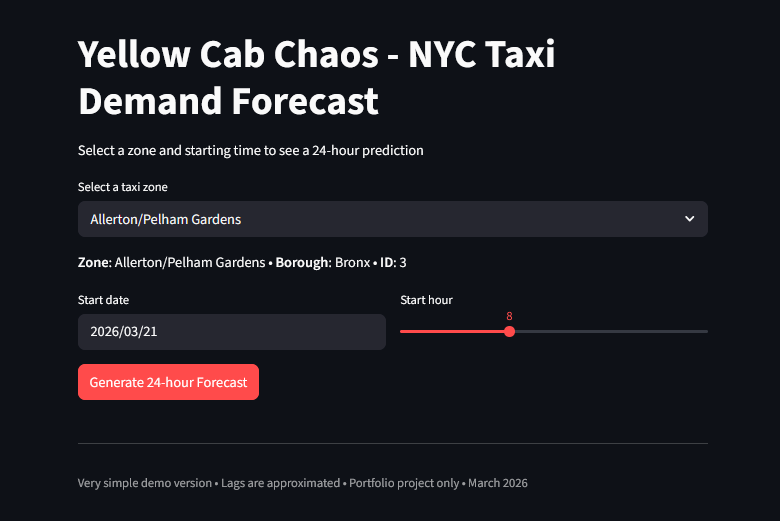

# 🚖 Yellow Cab Chaos – NYC Taxi Demand Prediction

<p align="center">
  <b>Yellow Cab Chaos is a fully deployed, production-ready system that:
    
Ingests live official government data from the NYC Taxi & Limousine Commission (TLC)

Forecasts hourly taxi demand per taxi zone for the next 7–30 days

Delivers an interactive Streamlit dashboard with real-time hotspot maps, what-if analysis, and retention/optimization recommendations for drivers and fleet operators
</b><br>
  Built with real-world data, time-series features & deployed via Streamlit
</p>

---

## 📌 Problem Statement
Ride-sharing and taxi companies lose millions every year because drivers idle in low-demand areas while hotspots go unserved.

*Solution:* Predict exact demand (number of trips) per taxi zone + hour, so drivers/fleets can reposition proactively.

- Reduce driver idle time by 20–35% (industry benchmarks from Uber/Lyft papers)
- Increase daily earnings per driver by ~$15–25
- Lower city-wide emissions by reducing unnecessary cruising
- Real-world users: Fleet operators, ride-hailing apps, urban planners, NYC TLC itself

*Complete Project Report* : https://docs.google.com/document/d/1gHOlmyPJuiRTTmnNUgF-0DptxpQyJkgV6hfJ9CorHUA/edit?usp=sharing

### 🌐 Live Demo

👉 *https://yellow-cab-chaos-jovinryan20.streamlit.app/*

---

## ⚙️ Tech Stack
- Python  
- Pandas, NumPy  
- Scikit-learn  
- XGBoost  
- Matplotlib / Seaborn  
- Streamlit  

---

## 🚀 Key Features
- Time-series forecasting (hourly level)  
- Lag features (24h, 168h)  
- Rolling statistics  
- Calendar-based features  
- End-to-end ML pipeline  
- Interactive Streamlit app  

---

## 📊 Model Performance

| Metric | Value |
|-------|------|
| MAE | ~5.3 trips |
| RMSE | ~12.3 |
| MAPE | ~47% |

### 💡 Insights
- Performs well in **high-demand zones**  
- Struggles in **low-demand (zero-heavy) zones**  
- Captures **daily & weekly seasonality effectively**  

---

## 🧠 Feature Engineering
- Lag features (previous hour/day/week)  
- Rolling averages  
- Hour of day  
- Day of week  
- Weekend indicator  
- Rush hour flag  

---

## 🏗️ Project Structure

yellow-cab-chaos/

│

├── data/

├── documentation/

├── models/

├── notebooks/

├── outputs/

├── scripts/

├── viz/ 

├── app.py

├── requirements.txt

└── README.md

## Data

Dataset not included due to size.

Download here:
https://drive.google.com/drive/folders/17wlbpf0HiageU6pziJ8k835kza2EiQ7E?usp=sharing

---

## 💻 How to Run Locally

```bash
git clone https://github.com/yourusername/yellow-cab-chaos.git
cd yellow-cab-chaos
```
### Create virtual environment
``` python -m venv venv ```

### Activate environment
### Windows
``` venv\Scripts\activate ```

### Mac/Linux
``` source venv/bin/activate ```

### Install dependencies
``` pip install -r requirements.txt ```

### Run Streamlit app
``` streamlit run app.py ```

## 📸 Project Preview

### 📊 Feature Importance


### 📈 Top 15 Zones by Total Trip volume


### 🌐 Actual vs Predicted


### 🌐 Streamlit App


## ⚠️ Limitations

- No external data (weather, events, traffic)

- High error in low-demand zones

- Single global model

- Not production-ready

## 📈 Future Improvements

- Add weather & event data

- Train zone-wise models

- Use LSTM / deep learning

- Add prediction intervals

- Deploy with CI/CD

## 📚 What I Learned

- Time-based train-test split is crucial

- Feature engineering > model complexity

- Handling zero-heavy time series

- Building end-to-end ML projects

## 📜 License

This project is licensed under the MIT License – see the [LICENSE](https://github.com/twbs/bootstrap/blob/main/LICENSE) file for details.

## 🙌 Acknowledgements

*NYC Taxi & Limousine Commission (TLC)*

⭐ If you found this useful, consider giving it a star!

Made with 💖 by *Jovin Ryan Samuel*
